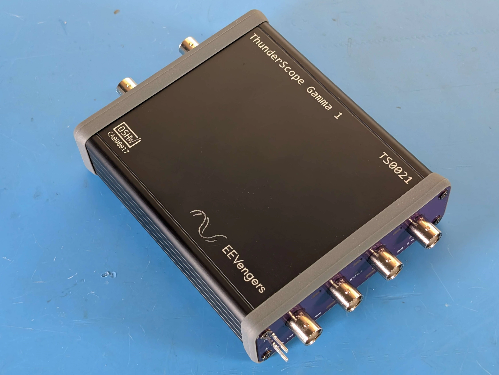
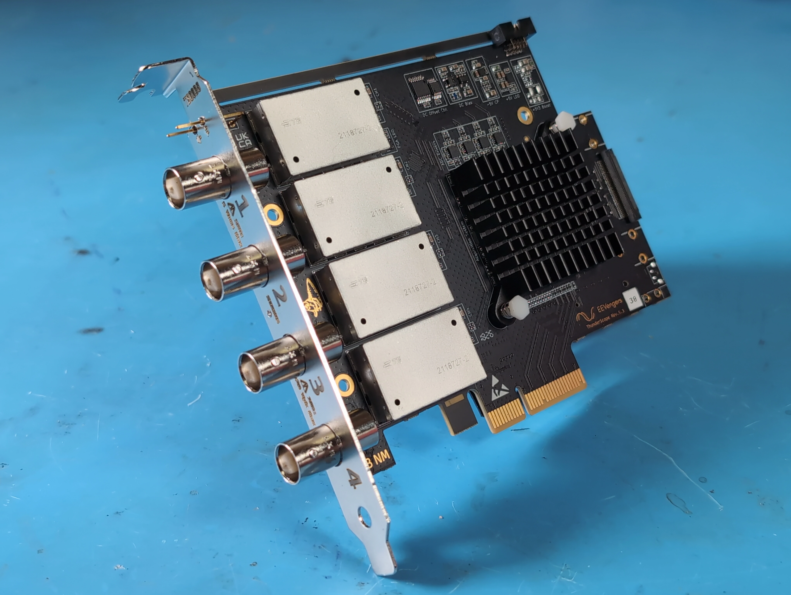

.. _Introduction:

Introduction
============

ThunderScope is a novel oscilloscope design that streams all 1 GB/s of its captured sample data in real-time to a host computer 
via Thunderbolt/USB4 or PCIe. 

ThunderScope is open source from volts to bits with the intention of serving as a foundation for 
future open source test equipment. If we could make open source the standard for 3D printing, why not do the same for the tools 
that make electrical hardware development possible?

Why Stream 100% of the Sample Data?
-----------------------------------

* **Host memory is used as sample memory**, resulting in the highest sample memory of any oscilloscope on the market today. 

* **Triggering is done on the host's CPU**, allowing for custom triggers to be written in standard procedural languages.

* **Display and post-processing is done on the host's GPU**, powerful hosts can display waveforms with zero dead time and do FFTs and protocol decodes in real-time.

These aspects of oscilloscope performance have always been set when an oscilloscope is purchased. These are also often the 
driving factors behind upgrading to a new model, or for paying the manufacturer to unlock features in the hardware you already own!  

With ThunderScope these aspects of performance are never artificially limited and will improve every time the host is upgraded. This 
makes ThunderScope useful for much longer than a typical oscilloscope.

Hardware Specifications
-----------------------

None of the above points matter for an oscilloscope without the analog performance to back it up, this is why a great deal of effort 
has been put into the analog front end used in ThunderScope. 

+---------------------------------------------------+-----------------------------------+                                 
| **Channels**                                      | 4                                 |
+---------------------------------------------------+-----------------------------------+
| **Analog Bandwidth**                              | 500 MHz                           |
+---------------------------------------------------+-----------------------------------+
| **Input Impedance**                               | 50 Ω, 1 MΩ                        |
+---------------------------------------------------+-----------------------------------+
| **Full Scale Input Voltage Range (1 MΩ)**         | 8 mVpp to 40 Vpp                  |
+---------------------------------------------------+-----------------------------------+
| **Full Scale Input Voltage Range (50 Ω)**         | 8 mVpp to 4 Vpp                   |
+---------------------------------------------------+-----------------------------------+
| **Max. Sample Rate**                              | 1 GS/s (8 Bit), 500 MS/s (12 Bit) |
+---------------------------------------------------+-----------------------------------+
| **Noise @ Full Bandwidth (Most Sensitive Range)** | 90 μVrms                          |
+---------------------------------------------------+-----------------------------------+