.. _Calibration:

Calibration
===========

All of the components in the signal chain have non-ideal properties. 
Calibration aims to compensate for these non-ideal properties 
so that the signal shown to the user is as close as possible to the signal at the input.
Calibration can involve physically changing the signal chain or changing the interpretation of it's output.
The types of calibration relevant to ThunderScope are discussed in the sections below in the order they are performed.

1. Buffer Low Frequency Response
--------------------------------

The ThunderScope front-end uses a BUF802 in composite loop mode as an input buffer. 
Composite loop mode splits the input signal into a low frequency path which is handled by the OPA140 opamp,  
and a high frequency path which goes to the BUF802 input. 
The frequency range covered by both parts is called the crossover region.

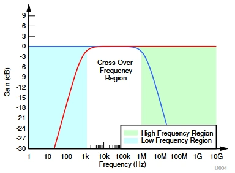

The gain applied to the high frequency path by the BUF802 can vary and is slightly less than 1x (0dB), 
as described in the datasheet excerpt below:

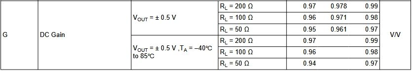

The crossover region is governed primarily by C1035, connected across the opamp. 
This cap has a fixed value in this design, which was determined to provide good crossover flatness.

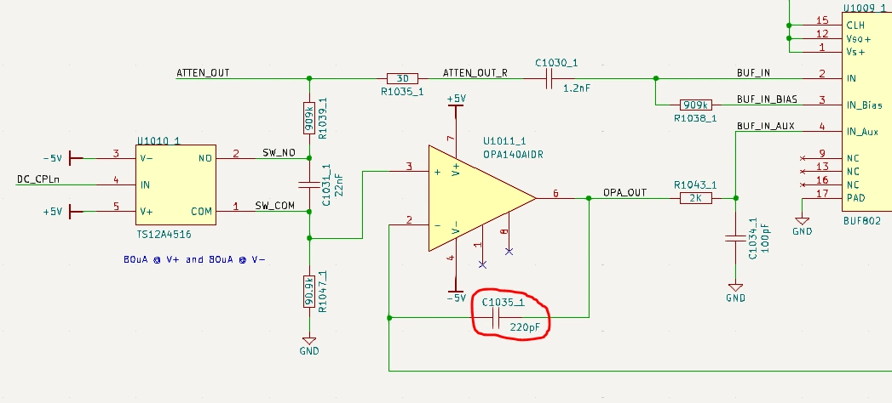

In order to make the overall response flat, the gain applied to the low frequency path by the opamp 
must be adjusted to match that of the gain applied to the high frequency path by the BUF802. 
This is done using the R1049 trimpot.

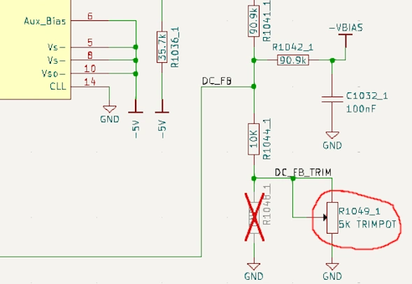
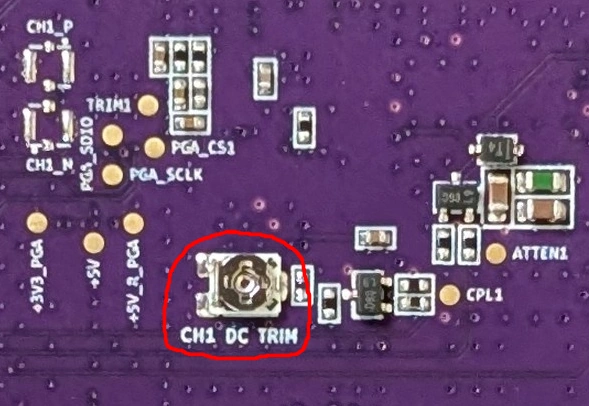

The procedure for calibrating the buffer low frequency response is as follows:

#. In 50 Ohm mode, measure the peak to peak value of a 500mVpp 10 MHz sine input at the 800mV range setting
#. With a 500mVpp 100 Hz sine input at the 800mV range setting, 
   tweak the trimpot until the unit measures the same value as the step above

An alternate procedure for calibrating the buffer low frequency response is as follows:

#. In 50 Ohm mode, measure a 500mVpp 100 Hz square input at the 800mV range setting
#. Tweak the trimpot until the square wave is square

.. todo::

    Add image showing adjustment

2. Attenuator High Frequency Response
-------------------------------------

ThunderScope uses a compensated attenuator in order to sample signals above the ADC input range. 
A compensated attenuator consists of a resistive divider in parallel with a capacitive divider. 
This is the same principle used in standard 10x oscilloscope probes.

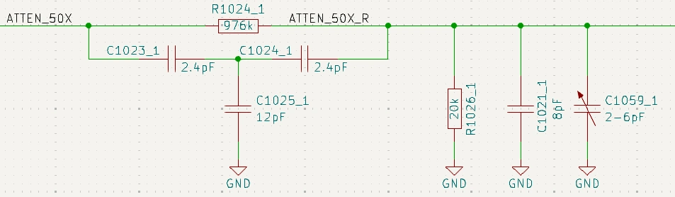

A resistive divider alone will always have some parasitic capacitance that dominates the response at higher frequencies,
so the capacitive divider is added in parallel to "drown out" the parasitics 
and make sure the attenuation holds constant at higher frequencies.

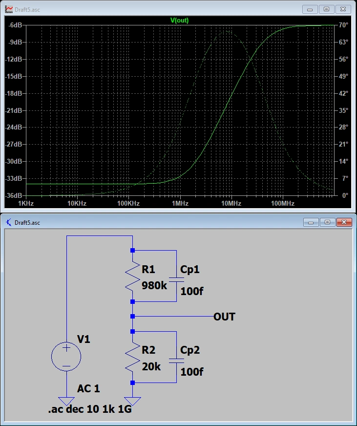
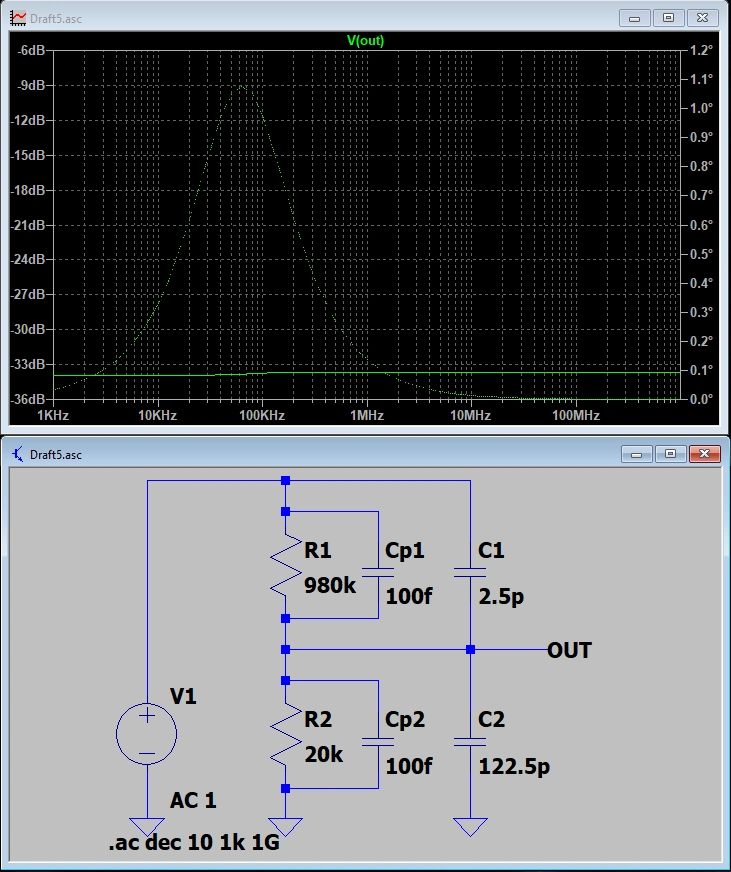

At very high frequencies, another parasitic effect comes into play. 
The equivalent series resistance and inductance of the larger lower leg capacitor, 
combined with the inductance in the return path, creates a RLC circuit, causing a resonant dip in the response.
This dip is inevitable, as long as there is inductance in the circuit. ThunderScope splits the capacitive divider
into two in order to use smaller capacitors, pushing this dip outside of the front end bandwidth.

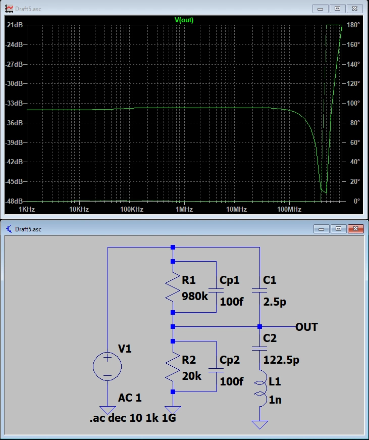
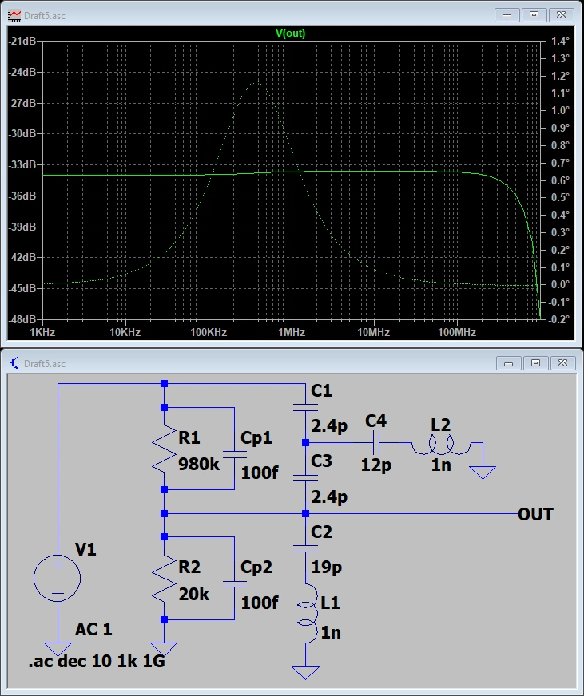

As with every aspect of this design that requires calibration, there is some uncertainty in this circuit. 
The input capacitance of the BUF802 (Cbuf) can vary slightly, in about a 1pF range. Since the capacitive dividers
use smaller values than previous revisions this variation can significantly impact the frequency response.
Therefore, a trimcap (C1059) was added to calibrate the capacitive attenuation factor
to match the resistive attenuation factor.

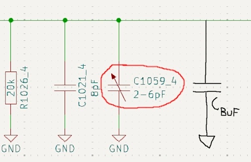
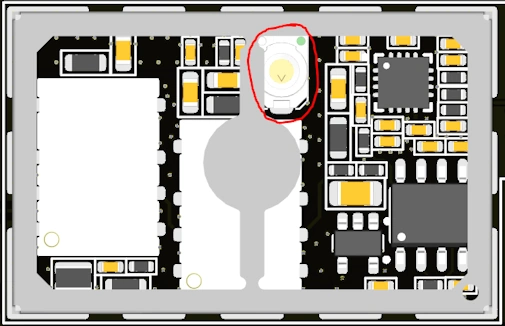

The procedure for calibrating the attenuator high frequency response is as follows:

#. In 50 Ohm mode, measure the peak to peak value of a 5Vpp 100 Hz sine input at the 10V range setting
#. With a 5Vpp 10 MHz sine input at the 10V range setting, 
   tweak the trimcap until the unit measures the same value as the step above

An alternate procedure for calibrating the attenuator high frequency is as follows:

#. In 50 Ohm mode, measure a 5Vpp 100 Hz square input at the 10V range setting
#. Tweak the trimcap until the square wave is square

.. todo::

    Add image showing adjustment

3. Passband Gains
-----------------

.. todo::

    Write this section

4. DC Offsets
-------------

.. todo::

    Write this section