.. _Acquisition-Controls:

Acquisition Controls
====================

This guide assumes you have installed the driver and software for ThunderScope. 
If you have not already done do, please follow the :ref:`getting started guide <Getting-Started>`.

Sample Rate
-----------

TODO - Effect on capture length with fixed memory depth

To change the sample rate, click on the down arrow next to "Sample Rate" on the stream browser menu

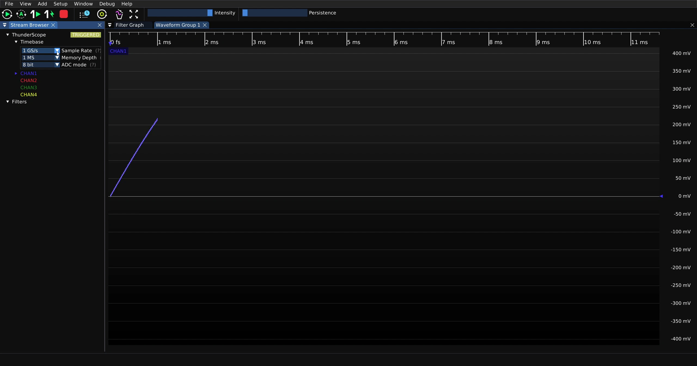

Then click on the desired sample rate from the drop down menu

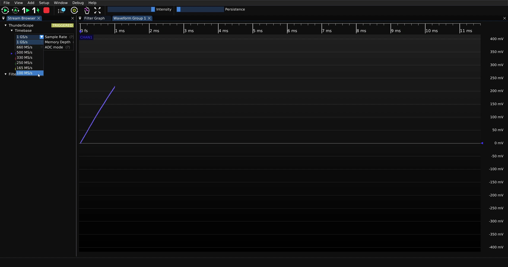

Note that lowering sample rate will increase capture length for a given memory depth and vice versa

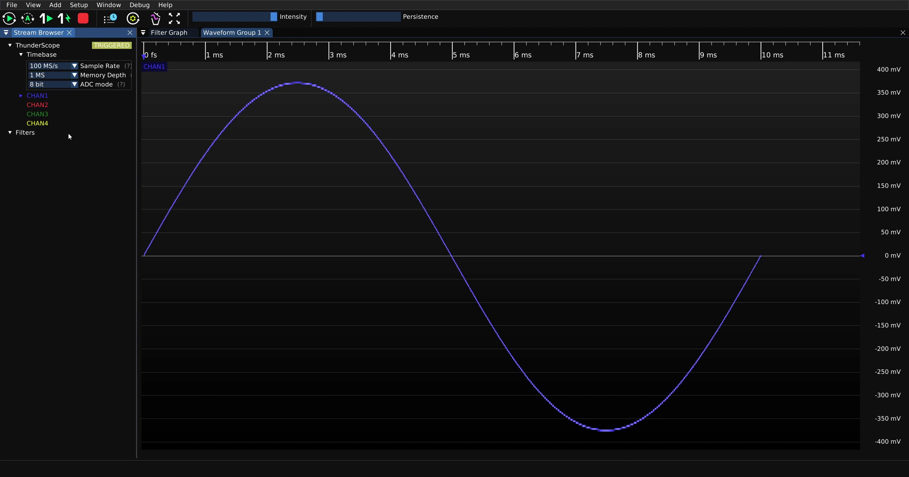

Changing sample rate can have a drastic effect on the captured waveform due to `Nyquist's Theorem <https://en.wikipedia.org/wiki/Nyquist%E2%80%93Shannon_sampling_theorem>`_.
Shown below is the a 10 MHz square wave captured at decreasing sample rates, starting with 1 GS/s:

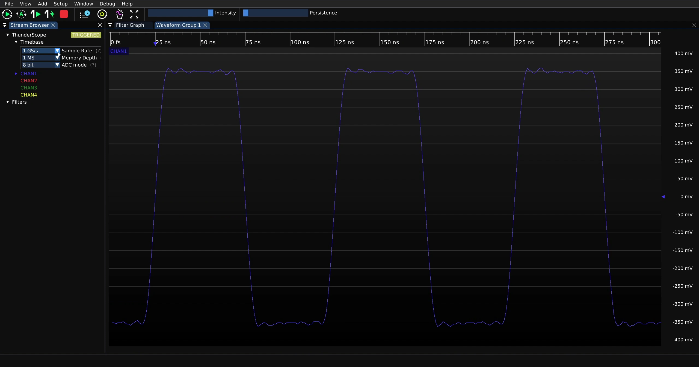

500 MS/s:

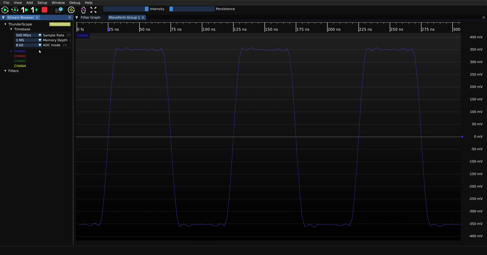

250 MS/s:

100 MS/s:

.. note::
    The effect shown above is compounded by the straight line interpolation used by ngscopeclient, 
    you can use the Upsample filter to get a more typical sine x/x interpolation. 
    For more on this, check out the :ref:`Introduction to Filters <Filter-Intro>` page.

Memory Depth
------------

TODO

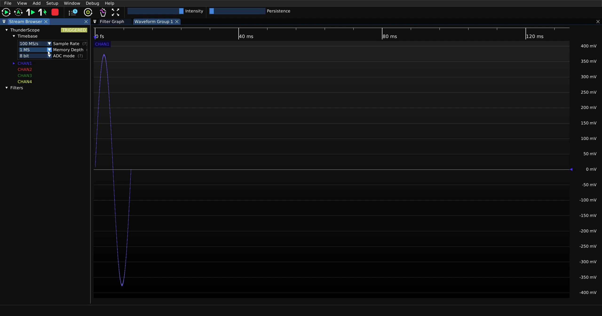
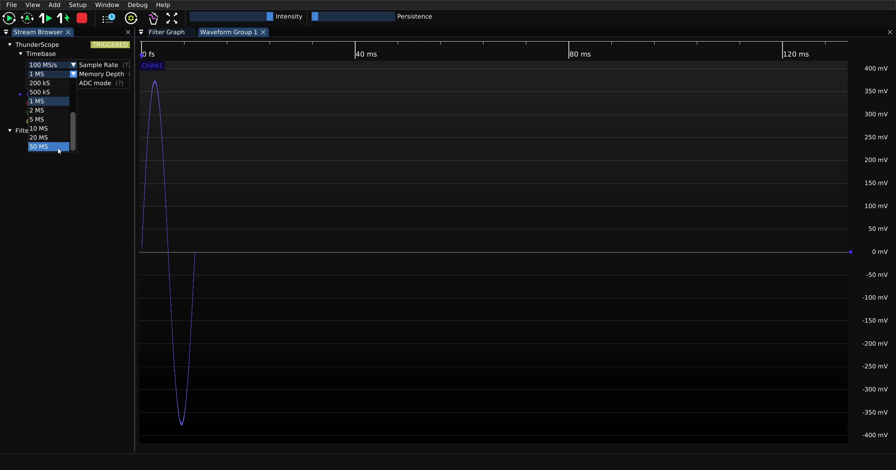
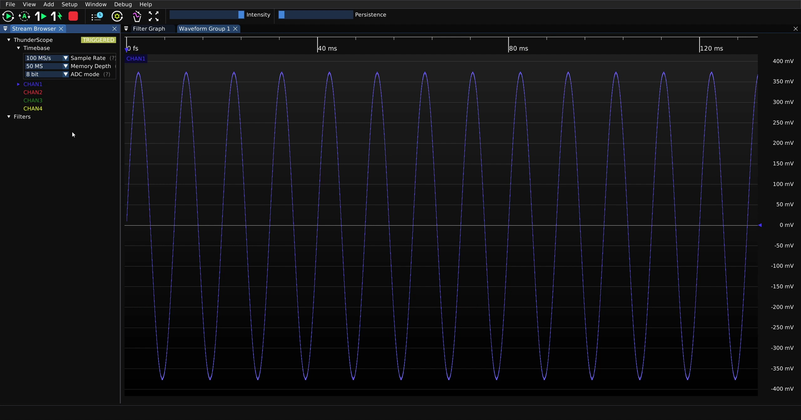

ADC Resolution
--------------

TODO

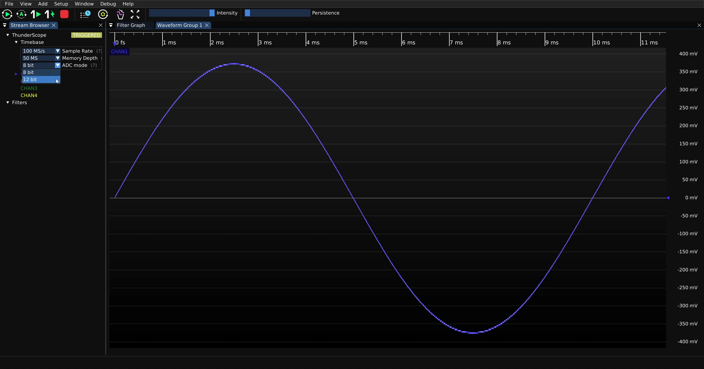
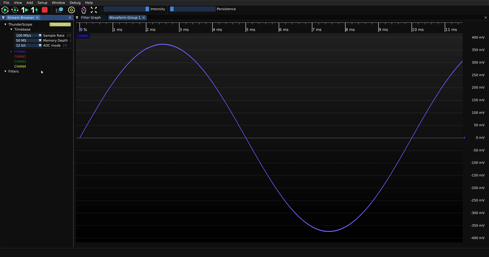

Active Channels Vs. Max. Sample Rate - 8 Bit
--------------------------------------------

TODO - explain interleaving and stress that memory depth is per channel! 

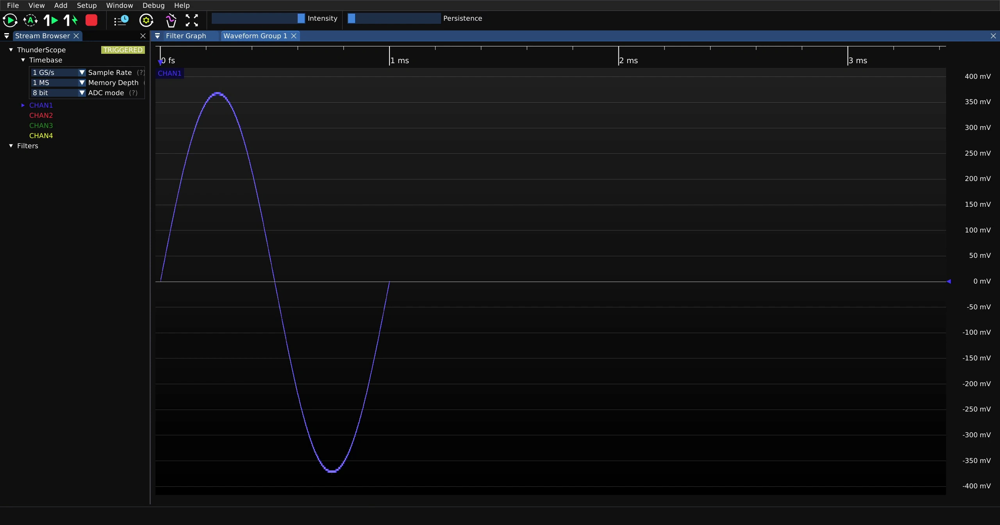
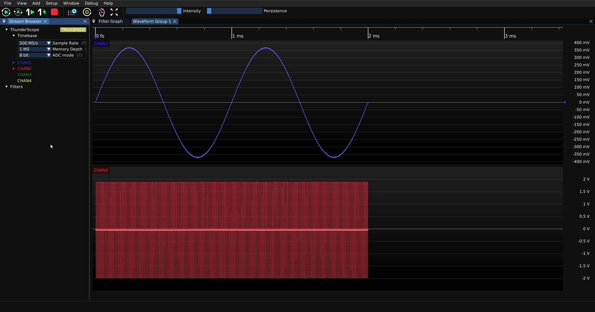
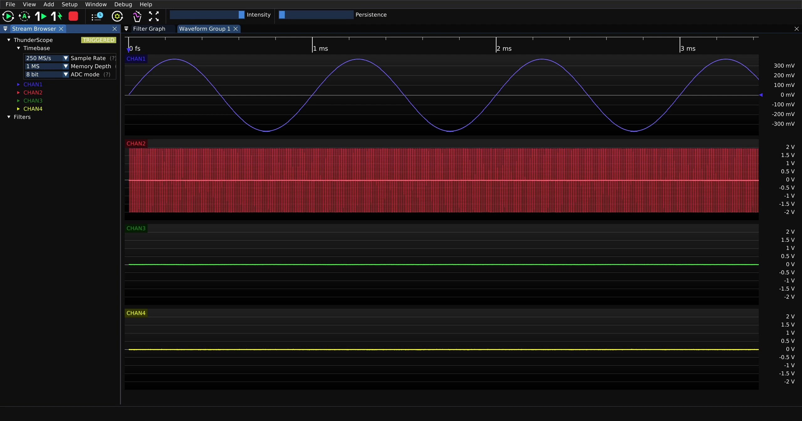

Active Channels Vs. Max. Sample Rate - 12 Bit
---------------------------------------------

TODO

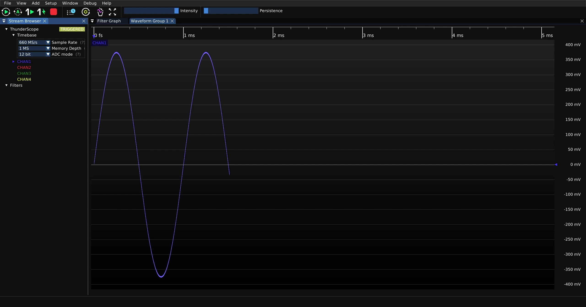
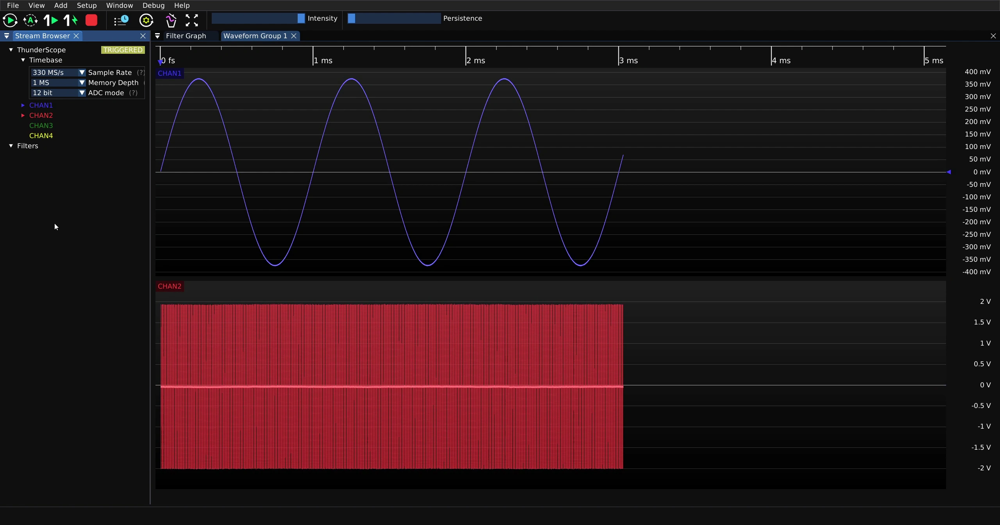
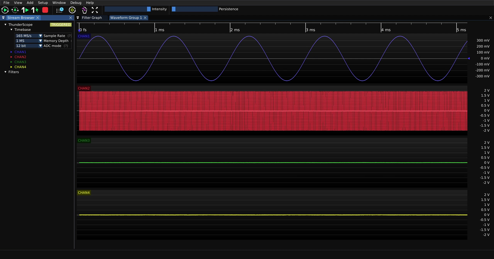