.. _Filter-Intro:

Filters 101
===========

This guide assumes you have installed the driver and software for ThunderScope. 
If you have not already done do, please follow the :ref:`getting started guide <Getting-Started>`.

What is a Filter?
-----------------

A filter is anything that is not a channel or a trigger. This includes measurements, math functions, protocol decodes, and reference waveforms. 
A filter may have scalar or waveform inputs and outputs, as well as parameters for configuring the filter. 

Filter Graph
------------

Filters show up as nodes alongside channels and the trigger in the filter graph, which represents the flow of data through its nodes.  

To access the filter graph, click on the "Filter Graph" tab. 
This is located next to "Waveform Group 1" by default, but may be rearranged just like a Waveform Group.

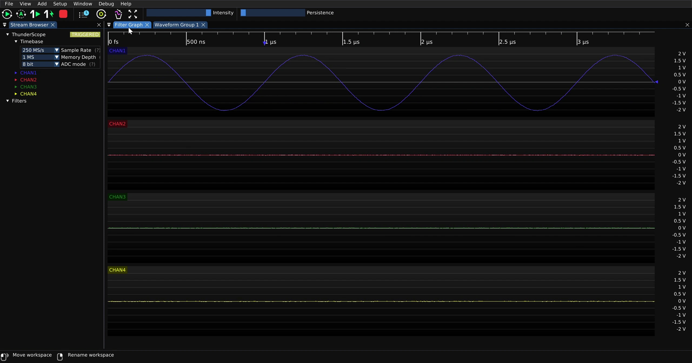

Shown below is the filter graph for four active channels and no active filters.

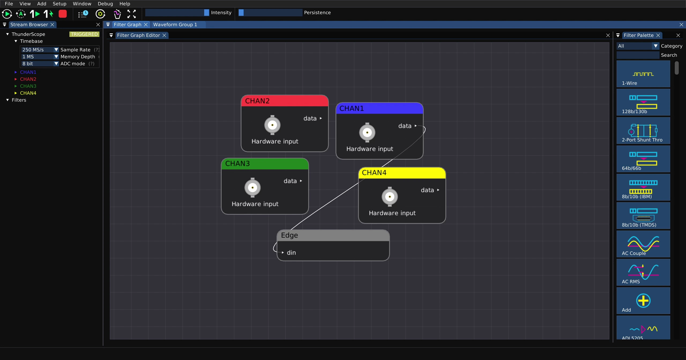

Making a Measurement
--------------------

Many measurements are simply a filter with a waveform input and a scalar output, such as a peak to peak measurement.
To add a measurement filter to the filter graph from the waveform view, right click on the label of the input channel.

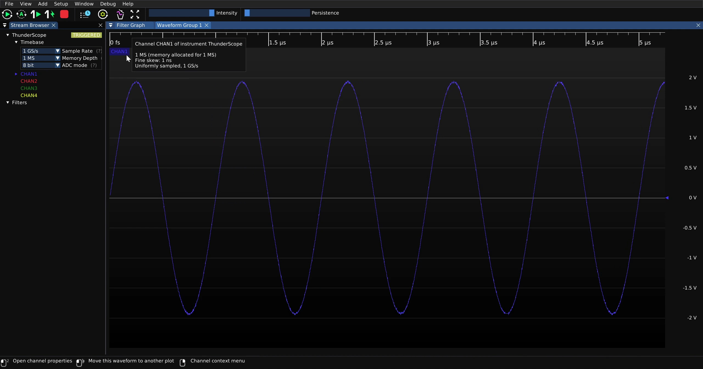

Mouse over the "Measurement" option in the resulting menu

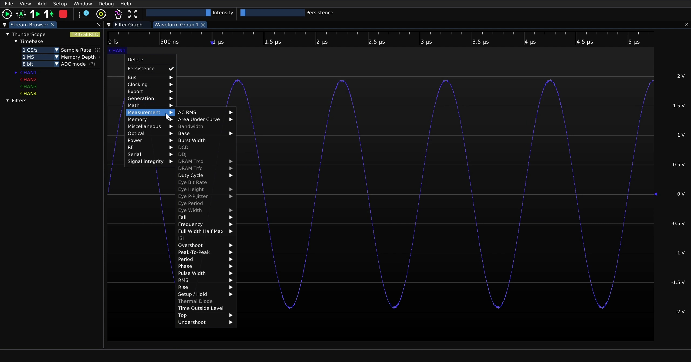

Mouse over the "Peak-To-Peak" option in the "Measurement" menu

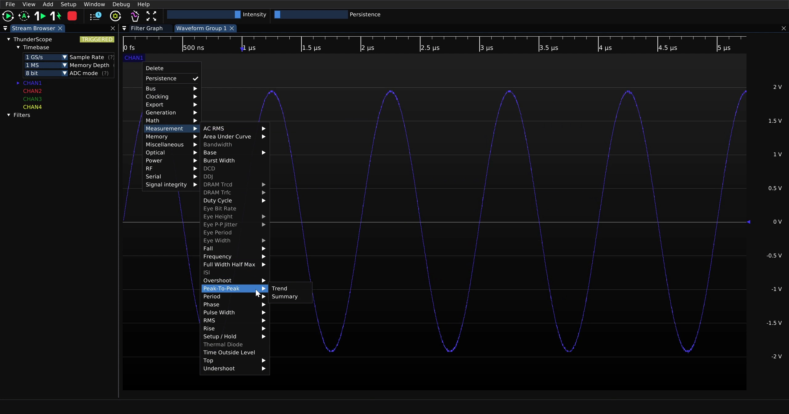

Select "Summary". This is the scalar output of the filter and is of interest for this example, while "Trend" is the waveform output.

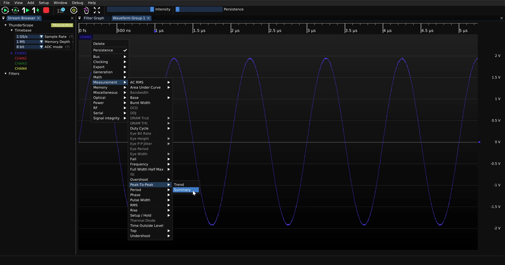

This will spawn the "Measurements" UI, which will show the current value of the measurement.

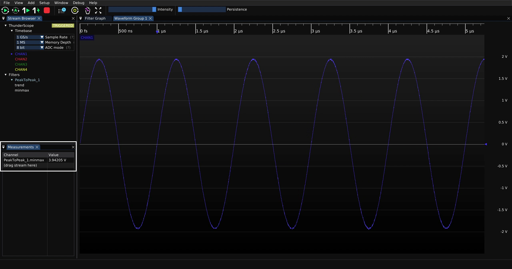

The resulting filter graph is shown below

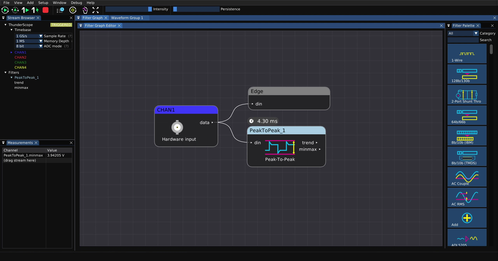

Measurement Statistics
----------------------

Statistics can be taken of a measurement by connecting the scalar output of the measurement filter to a math filer in the filter graph.
For example, to take an average, search for the average filter in the filter palette.

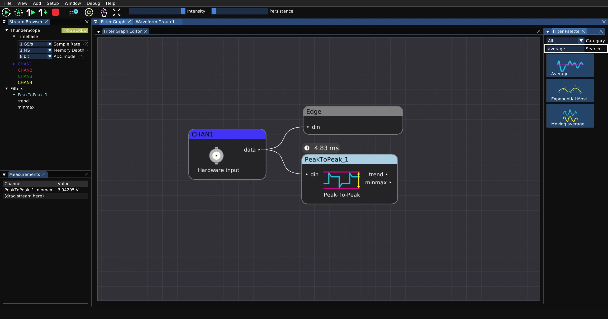

Drag the average filter into the filter graph

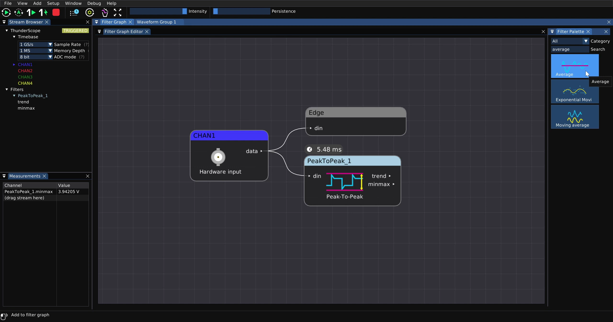

Then connect the "minmax" output of the peak to peak filter to the "in" input of the average filter

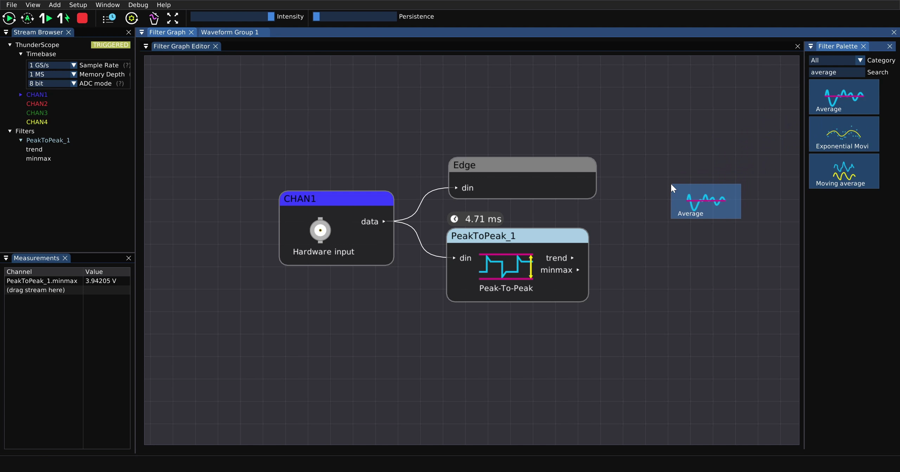

The "Average_1.cumulative" value in the "Measurements" UI will now start updating, this is the average peak to peak value of channel 1.

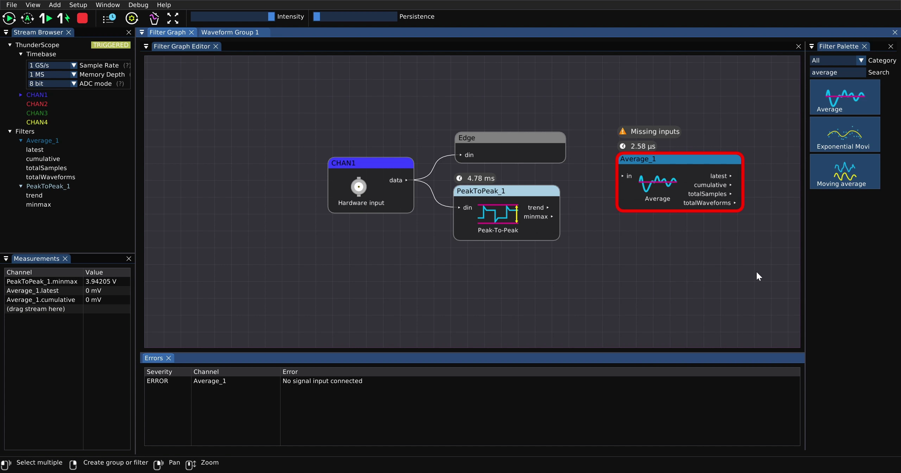

To clear the accumulated filter block state and start taking a fresh average, click on the clear button on the main toolbar.

.. image:: ./_images/ngscopeclient-stats-clear.webp
    :alt: TODO

Filters with Waveform Inputs and Outputs
----------------------------------------

Some filters have waveform outputs that are displayed the same way channels are. For example, the upsample filter.

.. todo::

    This section needs to be written.

Protocol Decode Example
-----------------------

.. todo::

    This section needs to be written.

Reference Waveforms
-------------------

Reference waveforms are generated by a filter with no inputs and a waveform output. 
These can be constants, built-in waveforms, or waveforms imported by the user.

.. todo::

    This section needs to be written.

