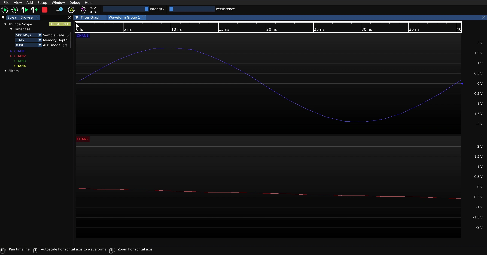
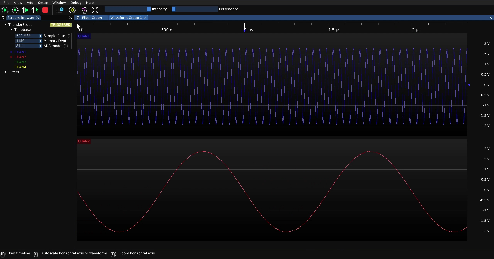
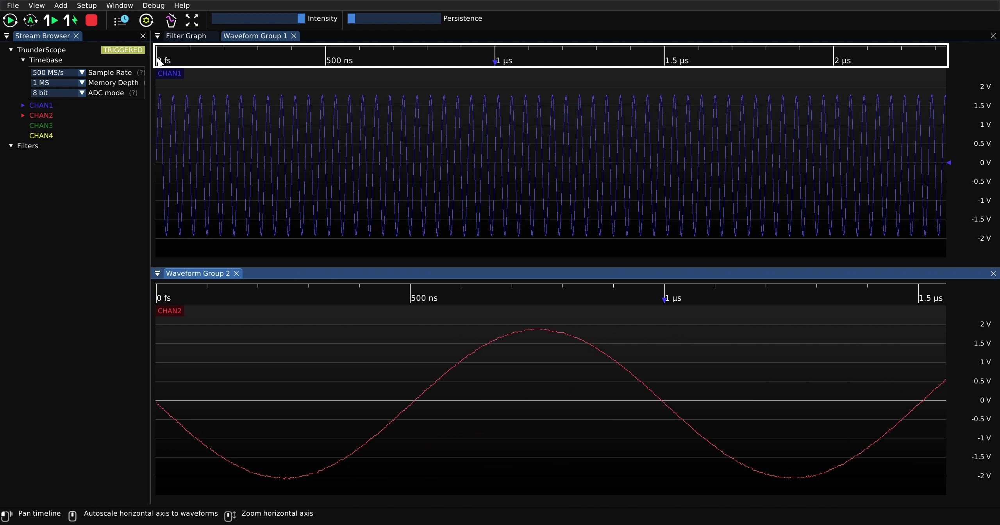
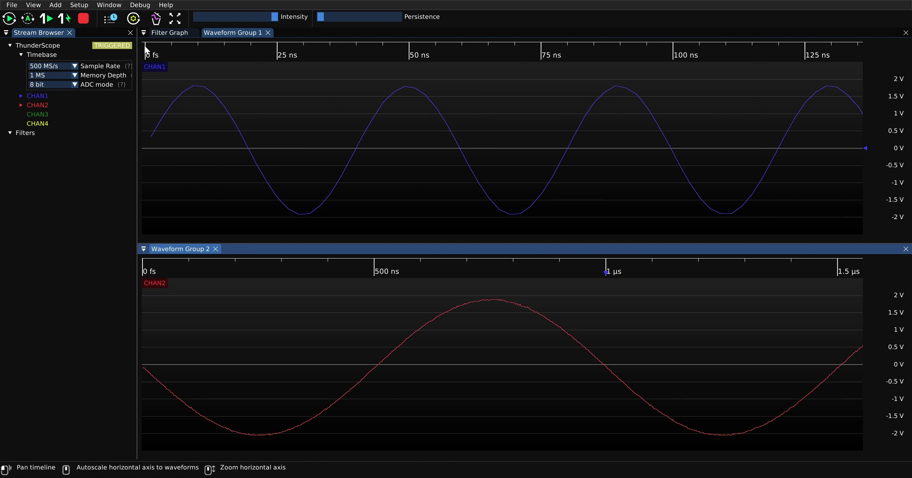
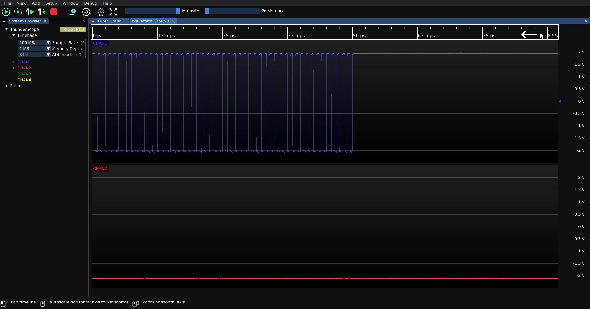
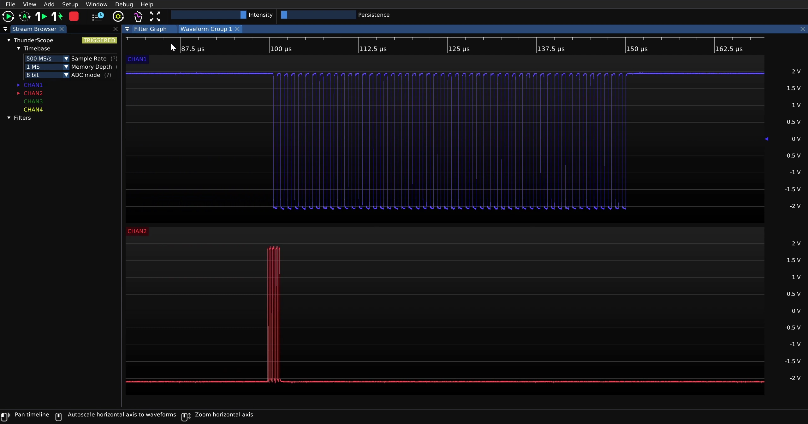
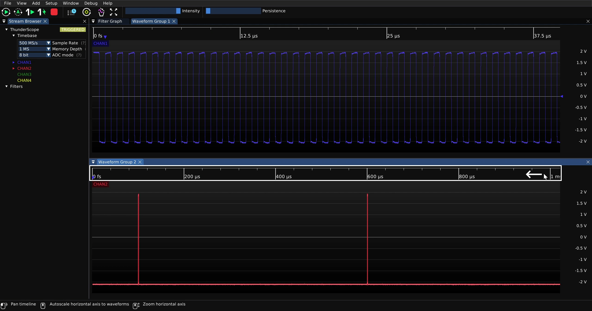
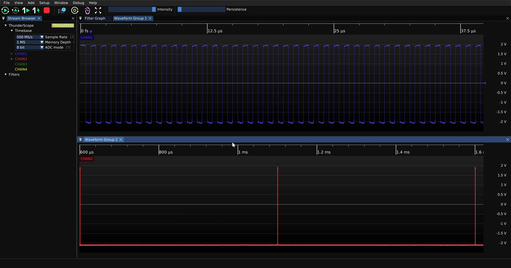

.. _Horizontal-Controls:

Horizontal Controls
===================

This guide assumes you have installed the driver and software for ThunderScope. 
If you have not already done do, please follow the :ref:`getting started guide <Getting-Started>`.

Horizontal Scale / Zoom
-----------------------

To change the displayed horizontal scale for a waveform group, click on the horizontal scale of the waveform group and scroll up or down for higher or lower horizontal scales.
This will change the horizontal scale for all waveform views in that waveform group.

Most scopes have this control adjust the sample rate automatically to fit the desired horizontal scale into the memory depth available, changing the length of the capture. 
In this case, this control is just a zoom in and out of the capture and never affects the length of the capture itself.

If the channels need to have separate horizontal scales, place them in separate waveform groups. Then the horizontal scale can be changed per waveform group.

Horizontal Pan
--------------

To pan across the capture, click on the horizontal scale of the waveform group and drag it left or right. 
This will pan across all waveform views in that waveform group. 

To be able to pan across channels separately, place them in separate waveform groups.

