.. _Managing-Waveforms:

Managing Waveforms
==================

This guide assumes you have installed the driver and software for ThunderScope. 
If you have not already done do, please follow the :ref:`getting started guide <Getting-Started>`.

Adding Channels to a Waveform View
----------------------------------

Drag a channel label from the stream browser over an existing waveform view to add the channel to an existing waveform view within its waveform group. 

The channel will share a displayed vertical scale and offset with every channel within the waveform view. This may differ from the channel's own vertical scale, in which case a warning will be displayed.

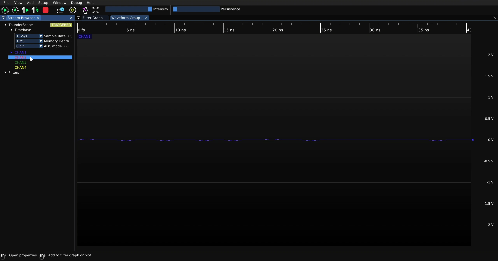

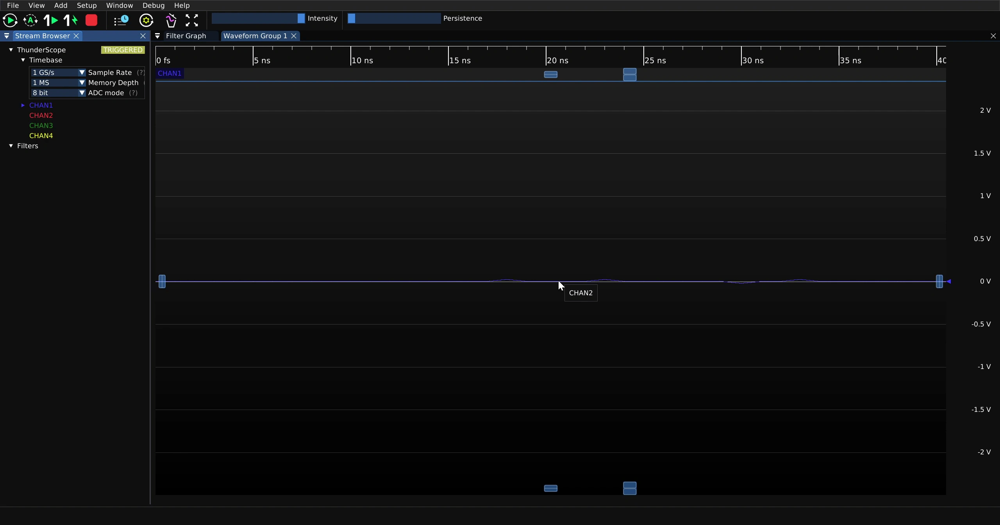

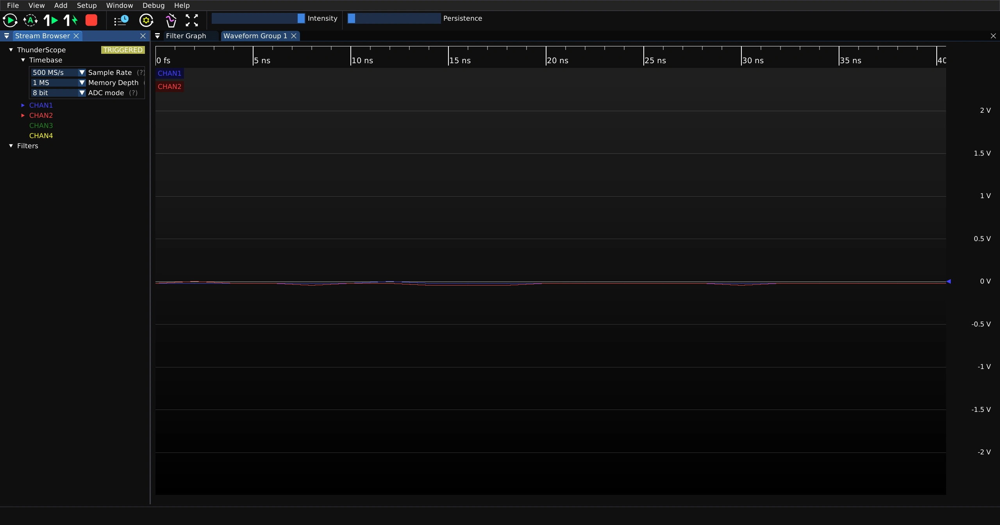

Adding Channels to a New Waveform View
--------------------------------------

Drag a channel label from the stream browser to either the top right or bottom right icon that appears over an existing waveform view to add the channel to a new waveform view above or below the existing waveform view. 

The new waveform view will have a separate displayed vertical scale and offset.

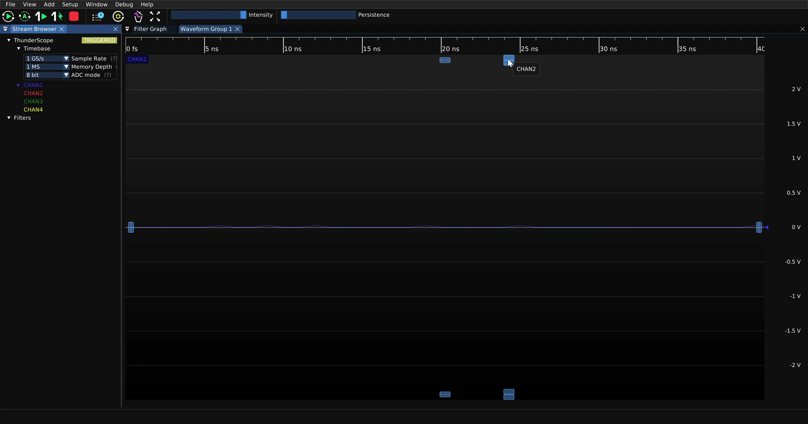
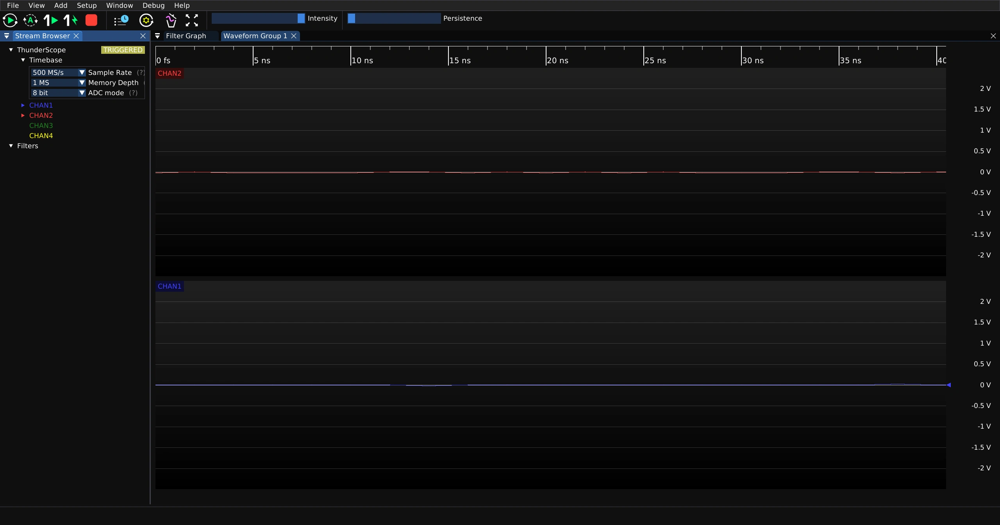

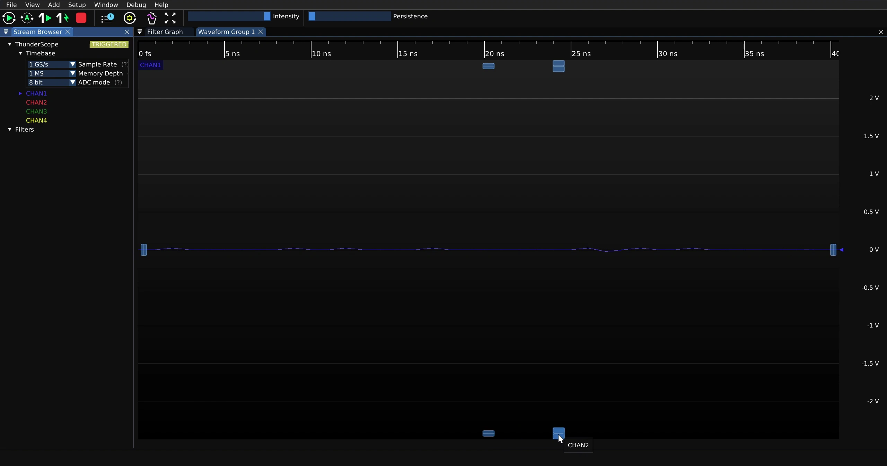
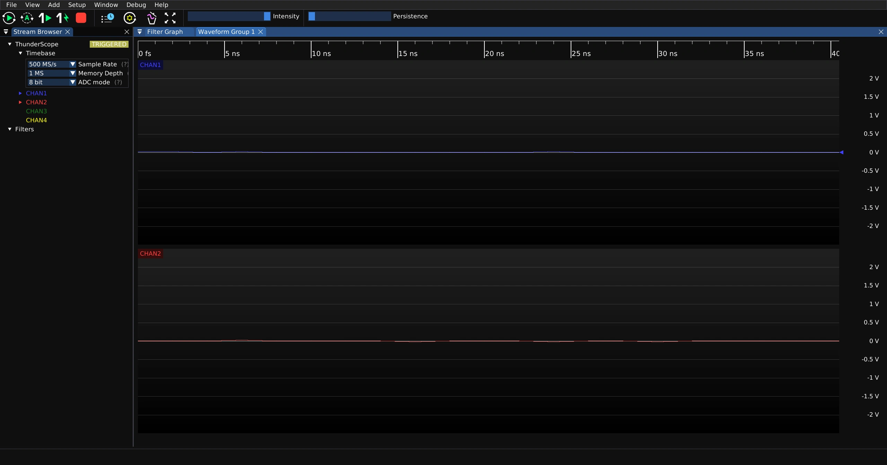

Adding Channels to a New Waveform Group
---------------------------------------

Drag a channel label from the stream browser to either the left, right, top left, or bottom left icon that appears over any waveform view in an existing waveform group to add the channel to a new waveform group to the left, right, above, or below the existing waveform view. 

The new waveform group will have a separate displayed horizontal scale, which is shared by every waveform view within the waveform group.

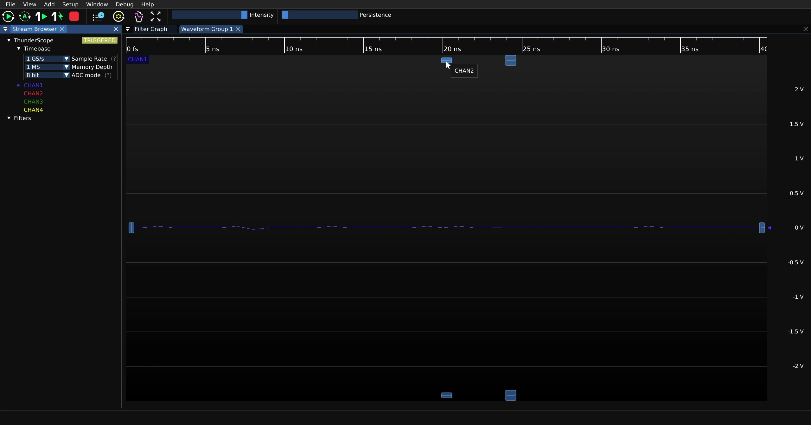
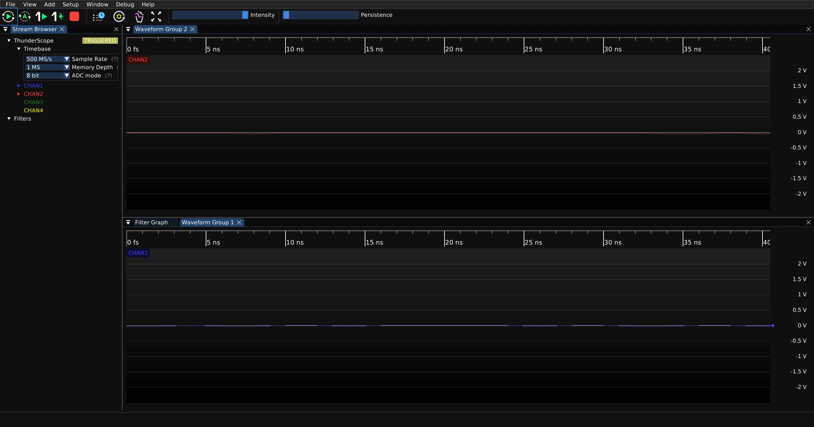

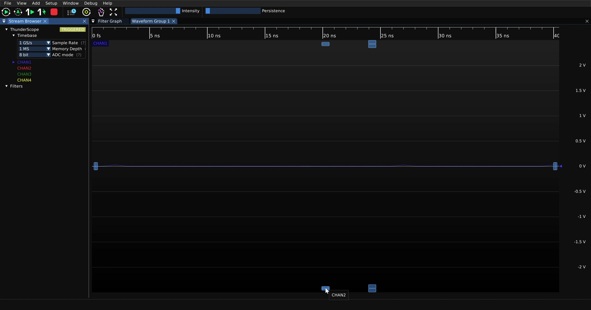
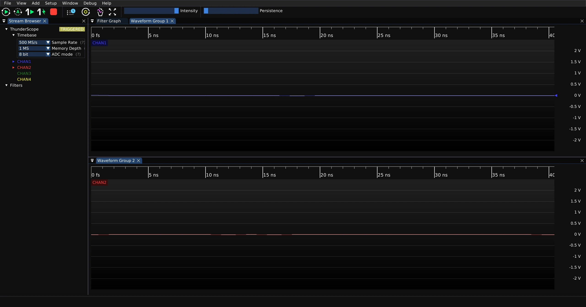

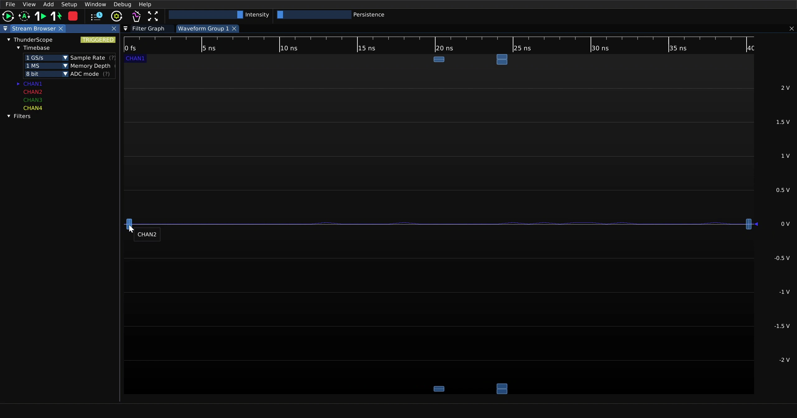
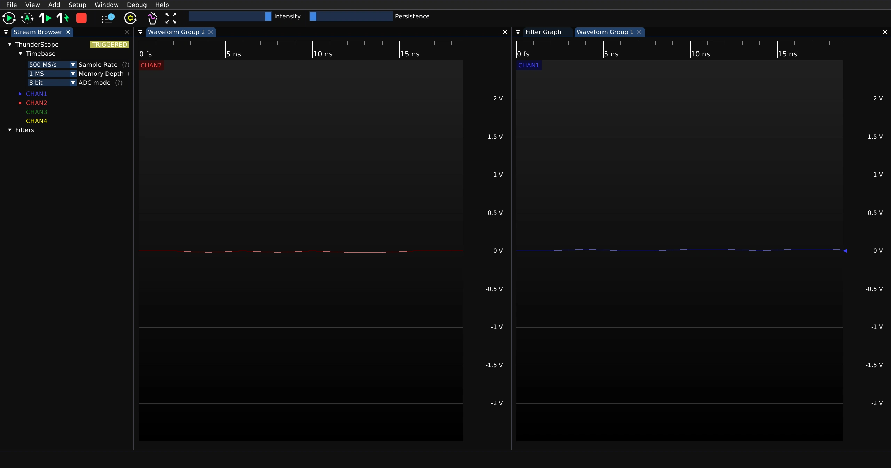

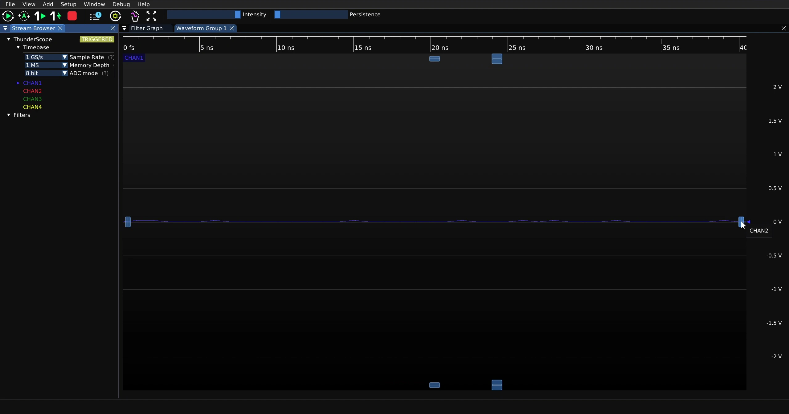
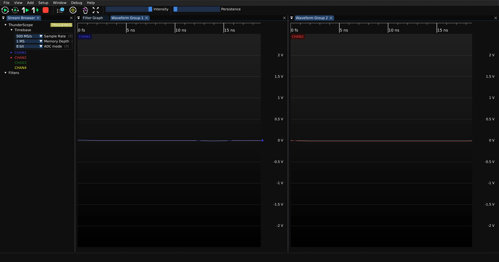

Deleting Channels 
-----------------

To delete a channel, right click the channel label on the top left of the waveform view and click on the "Delete" option in the resulting menu. This works in any configuration of waveform views and groups.

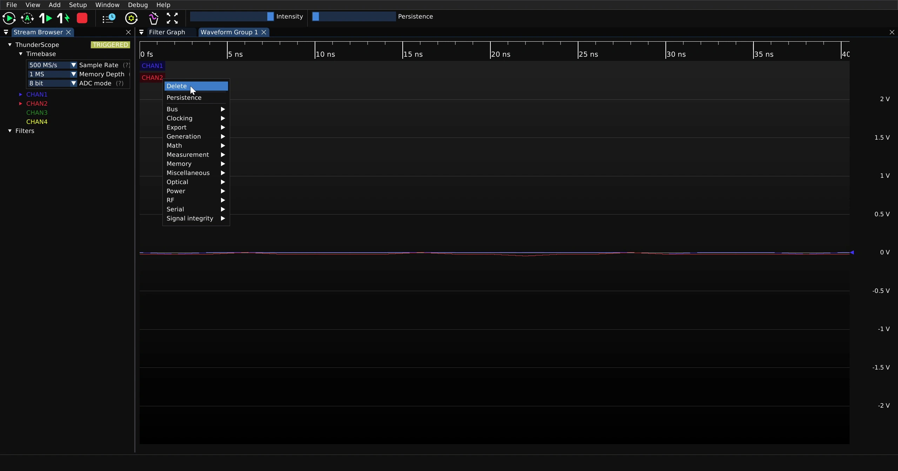

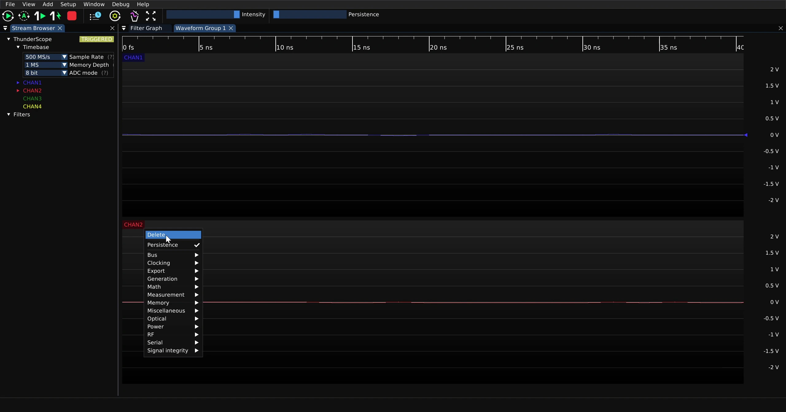

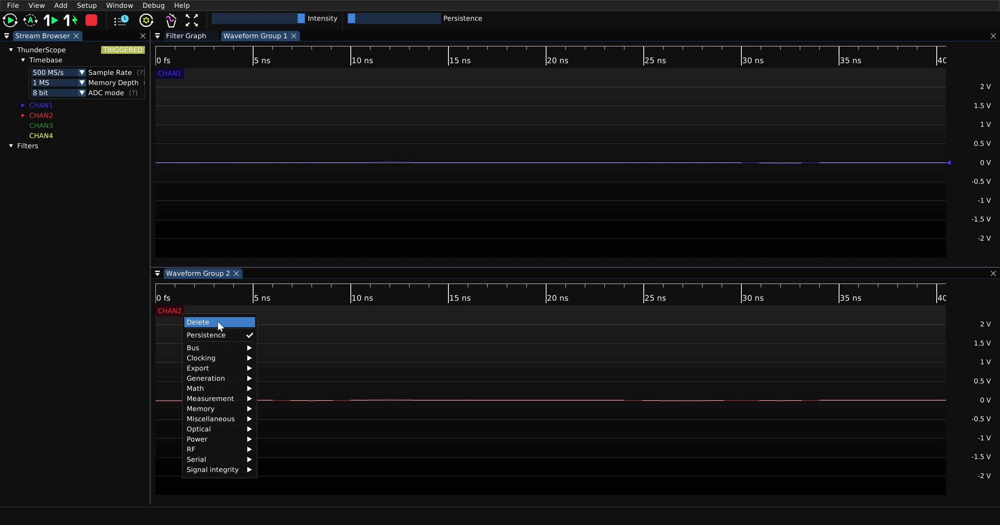