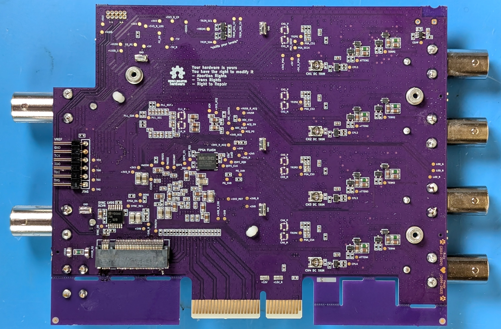

TS-USB4 Box-Build
========

This guide assumes you have a tested and calibrated TS-USB4 variant mainboard. 

.. image:: ./_images/TS-USB4-PCBA-Front.webp
  :width: 49%
  :alt: Front side of an assembled TS-USB4 mainboard

    

If you do not have a tested and calibrated TS-USB4 mainboard, check out the :ref:`Board Assembly Guide <Board-Assembly>` 
and then the :ref:`Testing and Calibration Guide <Testing and Calibration>`.

If you wish to convert your existing TS-PCIe variant PCBA, use the :ref:`Changing Variants Guide <Changing Variants>`.

Step 1: Source a USB4/TBT Adaptor
----------------

The USB4 variant of ThunderScope is designed to work with any M.2 NVME adaptor that:

#. Provides 4-lane PCIe tunneling to the host
#. Can be modified to output the USB voltage (VUSB) on the M.2 3V3 rail. 

The following is a table of chipsets that support 4-lane PCIe tunneling:

.. list-table:: Chipsets with 4-lane PCIe tunneling support
   :widths: 25 25 50
   :header-rows: 1

   * - Vendor
     - Part Number
     - Notes
   * - ASMedia
     - ASM2464PD
     - USB4, Poor support for older TBT3 hosts
   * - ASMedia
     - ASM2464PDX
     - Similar to above but has an internal PCIe switch
   * - Intel
     - JHL9480
     - TBT5
   * - Intel
     - JHL9440
     - TBT4 only version of above
   * - Intel
     - JHL7440
     - TBT4
   * - Intel
     - JHL6x40
     - TBT3
   * - Intel
     - DSL6x40
     - TBT3

.. warning::
    Your adaptor must use one of these to work with TS-USB4.
    
As designs with these chipsets may vary, this guide will not go in depth on determining if specific adaptors can be modified to output VUSB on the M.2 3V3 rail. Instead, a table of adaptors that are known to be modifiable to work with TS-USB4 is provided below:

.. _adaptor-table:
.. list-table:: Adaptor boards known to work with TS-USB4
   :widths: 10 50 40
   :header-rows: 1

   * - Vendor
     - Notes
     - Photo
   * - `JoneyTech <https://www.alibaba.com/product-detail/MAC-Compatible-Thunderbolt-3-Type-C_62255630952.html>`_
     - The black board shown in the listing, link only for documentation as they currently sell their JHL7440 solution from the same link, which may not work with the step below! 
     - .. image:: ./_images/JoneyTech-Adaptor.webp
        :alt: JoneyTech TBT3 to NVME adaptor, uses JHL6540 chipset on a black PCB
   * - `IOCrest <https://www.alibaba.com/product-detail/IOCREST-Certified-SSD-Enclosure-Thunderbolt-3_62400127925.html>`_
     - You can ask them to sell you only the PCBA
     - .. image:: ./_images/IOCrest-Adaptor.webp
        :alt: IOCrest TBT3 to NVME adaptor, uses JHL6540 chipset on a green PCB

Step 2: Modify the USB4/TBT Adaptor
----------------

.. tab:: JoneyTech

  Below is a photo of the JoneyTech adaptor, with components of interest annotated.

  .. image:: ./_images/JoneyTech-Adaptor-Annotated.webp
    :alt: JoneyTech TBT3 to NVME adaptor. It is annotated as described below.
  
  The procedure for this modification is as follows:

  #. Remove the ferrite bead (1) from the board. This will disconnect 3V3 from the M.2 connector.
  #. Solder one end of a wire to the (-) terminal of the VUSB current shunt (2). The (-) terminal is the terminal with the lower voltage during operation. We solder to this terminal so that our current draw can still be monitored by the PD controller.
  #. Solder the other end of the wire to the (+) terminal of the M.2 bulk capacitor (2). This will connect the USB voltage (VUSB) to the 3V3 pins of the M.2 connector.

  Once completed, your adaptor should look like the following photo:

  .. image:: ./_images/JoneyTech-Adaptor-Modified.webp
    :alt: JoneyTech TBT3 to NVME adaptor. It is modified according to the instructions above.  

.. tab:: IOCrest

  Below is a photo of the IOCrest adaptor, with components of interest annotated:

  .. image:: ./_images/IOCrest-Adaptor-Annotated.webp
    :alt: IOCrest TBT3 to NVME adaptor. It is annotated as described below. 

  The procedure for this modification is as follows:

  #. Remove the ferrite bead (1) from the board. This will disconnect 3V3 from the M.2 connector.
  #. Solder one end of a wire to the (-) terminal of the VUSB current shunt (2). The (-) terminal is the terminal with the lower voltage during operation. We solder to this terminal so that our current draw can still be monitored by the PD controller.
  #. Solder the other end of the wire to the (+) terminal of the M.2 bulk capacitor (2). This will connect the USB voltage (VUSB) to the 3V3 pins of the M.2 connector.

  Once completed, your adaptor should look like the following photo:

  .. image:: ./_images/IOCrest-Adaptor-Modified.webp
    :alt: IOCrest TBT3 to NVME adaptor. It is modified according to the instructions above. 

.. warning::
    This modification violates the M.2 specification, do not use this modified adaptor with anything other than a TS-USB4 without reverting the modification. Failure to do so will result in damage to the device it is used with.

Step 3: Design and/or source an interposer
----------------

The TS-USB4 mainboard is designed with a custom pinout M.2 connector in a fixed location on the board, 
while adaptors have variable dimensions between their USB connector and their M.2 connector.

The connection between the adaptor and the mainboard has two requirements:

* The PCIe signals need to be connected from the adaptor M.2 connector to the mainboard M.2 connector 
* The adaptor's USB-C port needs to be centered along the edge of the mainboard. 

An interposer board is used to accomplish these goals in a way where no changes are needed on the mainboard, 
essentially "soaking up" any changes in adaptor dimensions. 
Therefore, a new interposer will need to be designed in order to use a new adaptor.

If you are using one of the adaptors from the :ref:`table above <adaptor-table>`, the associated interposer design is available from the `ThunderScope repo <ts_hardware_repo_>`__.
These must be made on a 4-layer process with 0.8mm thick PCB and impedence control.

.. _ts_hardware_repo: https://github.com/EEVengers/ThunderScope/tree/master/Hardware/KiCad 

.. todo::

    Write instructions on how to design an interposer

Step 4: Install the adaptor on the interposer
----------------